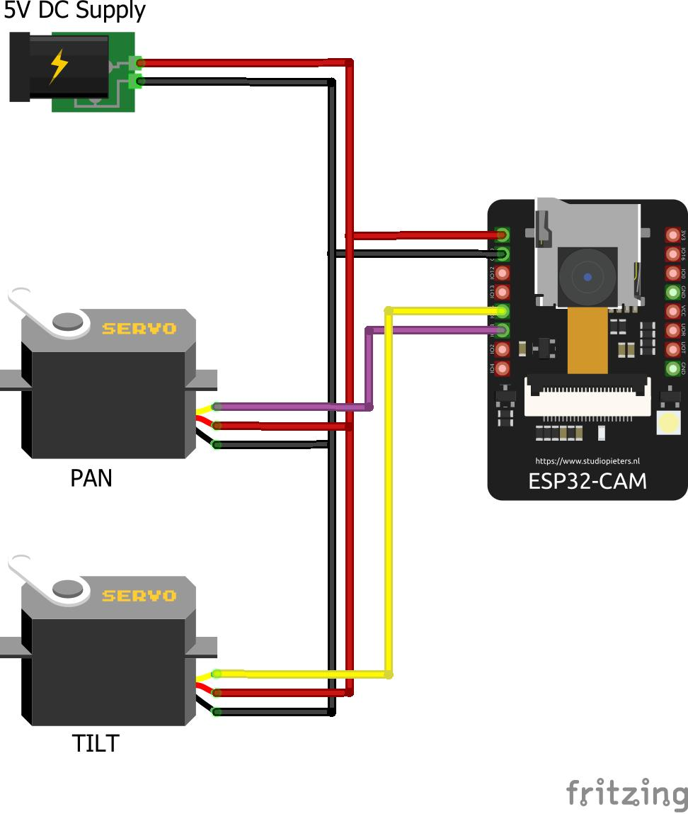

# PetMonitoring · 基于 ESP32-CAM 的远程宠物监视器

一块 ESP32-CAM + 两个 360° 连续旋转舵机组成的云台摄像头，网页上实时看家、按住方向键转动镜头（按住即转、松手即停），还能远程喊话陪宠物聊天；通过 Cloudflare Tunnel 公网访问，邮箱验证码登录，无需公网 IP、无需开端口、无需买服务器。

## 功能一览

| 功能 | 状态 | 说明 |
| --- | --- | --- |
| 实时视频流（MJPEG） | ✅ 已实现 | 最高 UXGA(1600x1200)，流断开自动降级为快照模式（约 3FPS） |
| 双舵机云台（左右/上下） | ✅ 已实现 | 360° 连续旋转舵机速度控制：按住即转、松手即刹；水平轴可无限转圈；俯仰轴无位置反馈，机械极限处勿长按（堵转易烧） |
| LED 补光灯 | ✅ 已实现 | 板载白色闪光灯 PWM 调光，夜间可看 |
| 远程语音对话 | ✅ 已实现 | 设备端 INMP441 麦克风录音 → 服务器做语音识别/AI 对话 → 网页端播放回复 |
| 远程录制 | ✅ 已实现 | 一键开始/停止，MJPEG 流推送到 NAS，用 ffmpeg 封装成视频 |
| 公网访问 + 邮箱鉴权 | ✅ 已实现 | Cloudflare Tunnel 内网穿透 + Access 邮箱验证码 + 仅限国内 IP |
| 远程喊话（下行音频） | 🔜 规划中 | 网页端语音 → 服务器 TTS → 设备端 MAX98357A 功放 + 喇叭播放；固件已预留 I2S 总线，扩展件见硬件清单 |

## 整体架构

```
              ┌────────────────────── 你家（无公网 IP 也可以） ──────────────────────┐
              │                                                                     │
  手机/电脑 ───┤   ┌──────────────┐   2.4G WiFi   ┌─────────────────────┐           │
  浏览器访问   │   │  局域网主机   │◄─────────────►│     ESP32-CAM       │           │
  pet.xxx.com │   │  (NAS/树莓派) │               │  ├ OV2640 摄像头    │           │
              │   │              │  HTTP :80     │  ├ 云台舵机 x2 (PWM) │           │
              │   │  cloudflared │──────────────►│  ├ INMP441 麦克风   │           │
              │   │  隧道客户端   │  HTTP :81     │  └ (选配)喇叭功放   │           │
              │   └──────┬───────┘   (视频流)    └─────────────────────┘           │
              │          │ 出站加密连接                                             │
              └──────────┼────────────────────────────────────────────────────────┘
                         ▼
              ┌─────────────────────┐        ┌──────────────────────┐
              │    Cloudflare 边缘  │        │   Cloudflare Zero    │
              │  WAF 规则: 仅国内 IP │───────►│  Trust Access        │
              │  Tunnel 入口        │        │  邮箱验证码登录       │
              └─────────────────────┘        └──────────────────────┘
```

要点：

- **ESP32-CAM 只跑固件**，对外暴露 2 个 HTTP 端口：`80` 控制/网页、`81` 视频流。
- **cloudflared 跑在局域网任意一台常开主机上**（NAS、树莓派、旧电脑都行），主动向 Cloudflare 建立出站隧道，家里**不需要公网 IP、不需要在路由器开端口**。
- 视频流走 `:81` 独立端口（esp-idf 的 httpd 单端口单线程，流会占死端口），隧道按 **URL 路径** `^/stream` 分流到 81，网页其余请求走 80。
- 安全分两层：**WAF 自定义规则**先把非国内 IP 挡在门外，**Access** 再用邮箱验证码确认是"自己人"。设备本身不出内网。

## 硬件清单

| 物品 | 数量 | 参考价 | 淘宝搜索关键词 | 备注 |
| --- | --- | --- | --- | --- |
| ESP32-CAM 开发板（AI-Thinker） | 1 | ¥25~35 | `ESP32-CAM 开发板 OV2640` | 必须带 PSRAM（默认款都有） |
| 360° 连续旋转舵机 | 2 | ¥8/个 | `FS90R 360度舵机` 或 `SG90 360度 连续旋转` | **必须是连续旋转型**，普通 0~180° SG90 与当前固件不适配 |
| 云台支架（2 自由度） | 1 | ¥8~15 | `SG90 二自由度云台支架` | 也可 3D 打印 |
| INMP441 I2S 麦克风模块 | 1 | ¥5 | `INMP441 I2S 全向麦克风` | 远程对话/监听用 |
| MAX98357A I2S 功放 + 4Ω 3W 小喇叭 | 1 套 | ¥8 | `MAX98357A I2S 功放板 喇叭` | 喊话扩展件，固件支持后即插即用 |
| 5V/3A 电源适配器 | 1 | ¥10 | `5V 3A 电源适配器` | 主板 + 舵机共用一路，"一拖二"分线接法见下方供电说明 |
| ESP32-CAM 烧录底座（或 USB-TTL 模块） | 1 | ¥10 | `ESP32-CAM 烧录底板 CH340` | 小白强烈推荐底座，免接线 |
| 杜邦线、470~1000µF 电解电容 | — | — | — | 电容并在舵机供电 5V/GND 之间（**建议必配**，吸收启动电流冲击） |

> **供电说明（重要）**：摄像头 + WiFi 启动瞬间电流可超 500mA，两个舵机转动/堵转电流合计可达 1.5A。正确接法是"**一个大电源 + 分线**"，**不需要两个充电器**：
> - 一个 **5V/≥3A** 电源，5V 和 GND 各分两路：一路接主板，一路直接接两个舵机（**并联**，两边都吃满 5V，电流各取所需）；
> - 所有 GND **必须共地**（主板 GND 与舵机电源 GND 连通），否则 GPIO 信号没有参考点，舵机收到的全是乱码；
> - 舵机供电端并一个 **470~1000µF 电解电容**（长脚接 5V、短脚接 GND，勿反接）；
> - 切勿从 ESP32-CAM 的 5V/3.3V 引脚给舵机取电——板载稳压器和走线带不动，这是 brownout 重启、摄像头初始化失败（0x105）的最常见原因。

### 接线表

所有引脚定义集中在 [src/hardware_config.h](src/hardware_config.h)，改接线只改这一个文件。

**① 云台舵机（360° 连续旋转舵机 × 2，50Hz PWM，速度控制）**

| 舵机线 | 接法 |
| --- | --- |
| 棕/黑 | GND（与主板共地） |
| 红 | 5V 电源（与主板并联同一路，**勿接主板 3.3V 引脚**） |
| 橙/黄（水平舵机） | GPIO 13 |
| 橙/黄（垂直舵机） | GPIO 12 |

> GPIO12 是启动 strap 引脚，正常接信号线无影响，但**不要**在它上面加上拉电阻，否则板子无法启动。

**接线参考图**（电源并联 + 共地结构；**注意**：图中信号线为社区示例，与本项目引脚定义可能不匹配，以接线表为准——本项目 GPIO13=水平、GPIO12=垂直）：



> **360° 舵机使用须知**：
> - 它没有"角度"概念，脉宽=油门：1.5ms 停止，1.0ms/2.0ms 全速正/反转；
> - 按住方向键 = 转动，松手 = 刹车（1.5ms 空挡）；上电默认双轴刹车；
> - 水平轴可无限转圈；俯仰轴无位置反馈，**顶到机械极限时勿长按**（堵转发热易烧舵机）；
> - 若转向与预期相反（360° 舵机个体差异，无统一标准），打开 [src/gimbal.cpp](src/gimbal.cpp) 把对应轴的 `-= GIMBAL_SPEED` 与 `+= GIMBAL_SPEED` 对调即可；
> - 转速手感由 [src/hardware_config.h](src/hardware_config.h) 的 `GIMBAL_SPEED`（0~100）调节。

**② INMP441 麦克风（远程对话用）**

| INMP441 引脚 | 接 ESP32-CAM |
| --- | --- |
| VDD | 3.3V |
| GND | GND |
| L/R | GND（左声道） |
| SCK | GPIO 14 |
| WS | GPIO 15 |
| SD | GPIO 33 |

> 接了麦克风后 GPIO33 被占用，板载红色小 LED 会失效（白色补光灯不受影响）。
> SD 卡占用 GPIO 2/14/15，与麦克风冲突，**本方案不支持 SD 卡**，录制走 NAS。

**③ MAX98357A + 喇叭（喊话扩展，选配）**

| MAX98357A | 接 ESP32-CAM |
| --- | --- |
| VIN | 5V |
| GND | GND |
| BCLK / LRC | 与 INMP441 并接 GPIO 14 / GPIO 15（共享 I2S 总线） |
| DIN | 喊话固件发布后指定（届时更新此处） |

## 软件架构

```
src/
├── main.cpp             # 入口: 摄像头初始化 / WiFi / 各模块启动
├── app_httpd.cpp        # HTTP 服务器: 网页托管 + 所有控制接口
├── hardware_config.h    # ★ 全部硬件引脚(摄像头/舵机/麦克风) + 服务器配置, 改这里即可适配硬件
├── gimbal.cpp/.h        # 云台: LEDC PWM 驱动双舵机(360°速度控制), FreeRTOS 任务 20ms 输出油门
├── talk.cpp/.h          # 对话: I2S 采音, WAV 流式 POST 到对话服务器
└── recorder.cpp/.h      # 录制: MJPEG 帧流 POST 到 NAS
page/
├── index.html           # 控制台网页 (构建时打包进 LittleFS 分区)
├── style.css / script.js
```

- **平台**：PlatformIO + pioarduino 社区平台（arduino-esp32 3.x / esp-idf 5.x）。选它是因为官方平台的 httpd 请求头上限固定 1024 字节，浏览器带 Cookie 访问会报 431，idf5 才可调。
- **网页**：三个前端文件构建为 LittleFS 镜像烧进 Flash（自定义分区：3.2MB App + 832KB LittleFS），不依赖任何外部托管。
- **并发**：舵机运动、麦克风采集各自跑独立 FreeRTOS 任务，不阻塞网络与摄像头。
- **观看席位**：esp-idf httpd 单线程，视频流同一时刻只支持 1 个观众；网页 10 分钟无操作自动关闭视频释放席位，流意外断开自动降级快照模式。

### HTTP 接口

| 接口 | 方法 | 说明 |
| --- | --- | --- |
| `/` `/style.css` `/script.js` | GET | 网页（LittleFS） |
| `/stream` | GET | MJPEG 视频流（**81 端口**，隧道模式经 `/stream` 路径转发） |
| `/capture` | GET | 单帧 JPEG 截图 |
| `/status` | GET | 摄像头参数 + 录制状态（JSON） |
| `/control?var=X&val=Y` | GET | 设置分辨率/画质/白平衡/补光灯 |
| `/ptz?dir=up\|down\|left\|right\|talk&action=down\|up` | GET | 云台方向键（按住/松开）；`dir=talk` 长按开始对话 |
| `/rec?state=start\|stop` | GET | 开始/停止推流录制到 NAS |

### 语音对话链路（已实现）

```
长按网页"对话"键 → ESP32-CAM INMP441 录音
  → WAV 以 HTTP chunked 流式 POST 到 TALK_SERVER
  → 后端: 语音识别 → 大模型 → TTS
  → 回复音频返回网页端播放
```

对话/录制服务器地址在 [src/hardware_config.h](src/hardware_config.h) 中配置；**留空则只打串口日志**，所以可以先把摄像头和云台跑起来，后端以后再搭。

## 公网访问与安全（Cloudflare Tunnel + Access）

前置条件：一个托管在 Cloudflare 的域名（免费套餐即可）。

### 1. 创建 Tunnel

在局域网常开主机（下例为 NAS，IP `192.168.0.32`，请替换成你的 ESP32-CAM 地址）上：

```bash
# 安装 cloudflared 后登录授权
cloudflared tunnel login

# 创建隧道
cloudflared tunnel create petmonitor

# 配置路由
cloudflared tunnel route dns petmonitor pet.你的域名.com
```

`~/.cloudflared/config.yml`（关键点：**用 path 规则把 /stream 分流到 81 端口**）：

```yaml
tunnel: <TUNNEL-ID>
credentials-file: /home/you/.cloudflared/<TUNNEL-ID>.json
ingress:
  - hostname: pet.你的域名.com
    path: ^/stream
    service: http://192.168.0.32:81
  - hostname: pet.你的域名.com
    service: http://192.168.0.32:80
  - service: http_status:404
```

```bash
cloudflared tunnel run petmonitor   # 建议配成 systemd 开机自启
```

### 2. 邮箱验证码登录（Access）

Cloudflare 控制台 → **Zero Trust → Access → Applications → Add → Self-hosted**：

- 域名填 `pet.你的域名.com`；
- Policy：`Allow` → Include → `Emails` → 填你和家人的邮箱；
- 登录方式保持默认的 **One-time PIN**（邮箱验证码）。

之后任何人打开网页，必须先输入许可邮箱接收验证码才能进入。

### 3. 仅限国内 IP（WAF 规则）

Cloudflare 控制台 → **安全 → WAF → 自定义规则**，新建一条：

```
表达式: (not ip.geoip.country in {"CN"})
操作:   Block
```

非国内 IP 在边缘直接被拒，连 Access 登录页都看不到。想只让自己常用地访问，把国家代码换成你所在的省份级 ASN/IP 段亦可。

> 三层防线总结：**WAF 国家限制 → Access 邮箱验证 → 设备不出内网**。ESP32-CAM 全程只监听局域网，被攻破面只剩 Cloudflare 一层。

## Get Started：小白从零到看家

预计 40 分钟：接线 10 分钟 + 装环境 10 分钟 + 烧录 10 分钟 + 验证 10 分钟。

### 第 1 步：接线

1. 按上面**接线表**和**接线参考图**接好两个舵机：一个 5V/3A 电源 5V/GND 分两路（主板一路、舵机一路），全部共地，电容别忘了；
2. INMP441 麦克风暂时可以不接——不接也不影响其他功能；
3. ESP32-CAM 插到烧录底座上，底座 USB 线连电脑。

> 只接摄像头 + WiFi 也能跑通第 1~5 步，舵机可以之后再插。**记住"并联分线 + 共地 + 电容"**。
> 舵机信号线先不用纠结"哪只是水平哪只是垂直"：装好后按"上/下"键实测，会动的那只装垂直位置即可。

### 第 2 步：装开发环境

1. 安装 [Visual Studio Code](https://code.visualstudio.com/)；
2. VS Code 扩展商店搜索 `PlatformIO IDE` 安装（首次会自动下载内核，等进度条走完）；
3. Windows 用户装 [CH340 串口驱动](https://www.wch.cn/downloads/CH341SER_EXE.html)（烧录底座/USB-TTL 常用芯片）。

### 第 3 步：打开项目并配置 WiFi

1. VS Code → 文件 → 打开文件夹 → 选择本项目目录；PlatformIO 会自动下载平台和工具链（右下角有进度，耐心等）；
2. 打开 [src/main.cpp](src/main.cpp)，找到这两行，**改成你家的 WiFi**（必须是 2.4GHz，ESP32 不支持 5G）：

```cpp
const char* ssid = "你家WiFi名称";
const char* password = "你家WiFi密码";
```

### 第 4 步：烧录固件 + 网页

VS Code 左下角蓝色状态栏：

1. 点插头图标（Upload）→ 烧录固件。若卡在 `Connecting......____`：
   - 底座：按住底座上的 **IO0/RESET** 按钮组合进入下载模式后重试；
   - USB-TTL：断电，用杜邦线把 **GPIO0 → GND** 短接，再上电，即进入下载模式；
2. 点云朵图标下方 **PlatformIO: Upload Filesystem Image**（或终端执行 `pio run -t uploadfs`）→ 把网页文件烧进 Flash。**这一步不做，打开网页会提示 File not found！**

### 第 5 步：首次开机验证

1. 烧录完成后点显示器图标（Serial Monitor，115200），给板子重新上电；
2. 串口应依次输出：摄像头就绪 → `WiFi connected` → `[Gimbal] 舵机已就绪` → `Camera Ready! Use 'http://192.168.x.x' to connect`；
3. 浏览器打开串口里的地址，你应该看到：视频画面、右侧云台方向键（按住转动镜头）、分辨率/画质调节、补光灯开关、录制按钮。

到这一步，**局域网监控已经可用**。以下为可选进阶。

### 第 6 步（可选）：公网访问

按上文 [公网访问与安全](#公网访问与安全cloudflare-tunnel--access) 三步配置 Tunnel、Access、WAF。完成后手机在外网打开 `https://pet.你的域名.com`，邮箱收验证码登录即可。

### 第 7 步（可选）：远程录制到 NAS

1. 在 NAS/电脑上开一个接收接口（例如 `ffmpeg -f mjpeg -i http://0.0.0.0:8000/rec -c copy out.avi`，或自写 HTTP 服务收流存盘）；
2. 在 [src/hardware_config.h](src/hardware_config.h) 里把 `REC_SERVER_HOST` 填成接收机内网 IP，重新烧录；
3. 网页点"开始录制"即可。

### 第 8 步（可选）：语音对话后端

同样在 [src/hardware_config.h](src/hardware_config.h) 填 `TALK_SERVER_HOST`。后端收到 WAV 流后走 `语音识别 → 大模型 → TTS`，把回复音频返回网页播放。服务器未配置时该功能仅打串口日志，不影响其他功能。

## 常见问题（FAQ）

| 现象 | 原因与解决 |
| --- | --- |
| 串口报 `Brownout detector was triggered` 或反复重启 | 供电不足。用独立 5V/≥1A 电源给主板，别靠 USB-TTL 供电；可在 5V/GND 间并 470µF 电容 |
| `Camera init failed with error 0x105` / `0x20001` | 摄像头排线没插紧或供电问题。断电重插排线（金手指朝向正确），换足瓦电源 |
| 烧录时报 `WinError 31` / 串口打不开 | 换 USB 线与 USB 口、重装 CH340 驱动；仍不行多为底座串口芯片损坏，换底座或 CP2102 模块 |
| 打开网页提示 `File not found` | 忘了烧网页：执行 `pio run -t uploadfs` |
| 外网访问画面黑屏但截图可用 | 隧道没配 `/stream` 的 path 规则到 81 端口；网页会自动降级快照模式，配好即恢复 |
| 提示"长时间未操作，视频已自动关闭" | 视频流只支持 1 个观众，10 分钟无操作自动释放席位，点"启动视频"恢复 |
| 舵机一动板子就重启/花屏 | 电源电流不足或舵机从主板取电导致电压跌落。用一个 5V/≥3A 电源"一拖二"分线、共地、并电容 |
| 按方向键舵机转向与预期相反 | 360° 舵机正反方向无统一标准。打开 [src/gimbal.cpp](src/gimbal.cpp)，把对应轴的 `-= GIMBAL_SPEED` 与 `+= GIMBAL_SPEED` 对调 |
| 松手后舵机停不下来 | 旧版固件行为，现版松手即输出 1.5ms 空挡刹车；若仍出现请确认已烧录最新固件 |
| 舵机完全不动、只有嗡嗡声 | 检查三件事：电源是否共地、信号线是否接对 GPIO（13=水平/12=垂直）、舵机是否被机械结构卡死 |
| 手机连不上热点里的 5G WiFi | ESP32 只支持 2.4GHz，请连 2.4G 频段 |

## 致谢与许可

- 固件基于 Espressif 官方 [esp32-camera](https://github.com/espressif/esp32-camera) CameraWebServer 示例二次开发，云台/语音/录制为新增模块；
- 网页与固件修改部分遵循原项目 Apache-2.0 许可。
